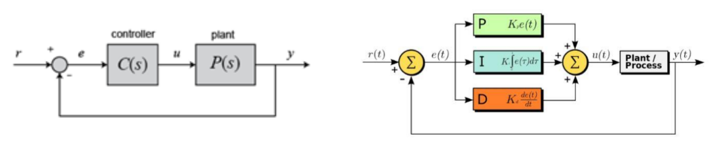
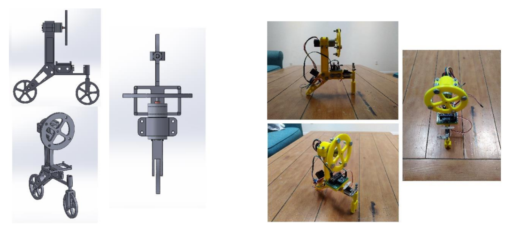
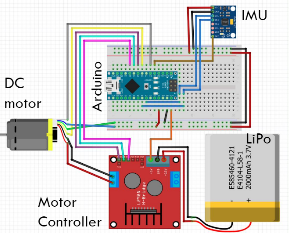

Self-Balancing Bicycle
---
Our group made a prototype for a self-balancing bicycle that utilizes a PID controller to maintain a vertical pose. This problem is modeled as an inverted pendulum and uses a flywheel to impart a reactionary torque on the bicycle. [Version 2](https://github.com/Ebaker310/Robotics-and-Computer-Vision/blob/master/01%20Intro%20to%20Robotics/Final%20Project/pics/Version2.PNG) coming soon.

**Feedback Controller:**

**Mechanical Hardware Design:**

**Electrical Hardware Design:**

