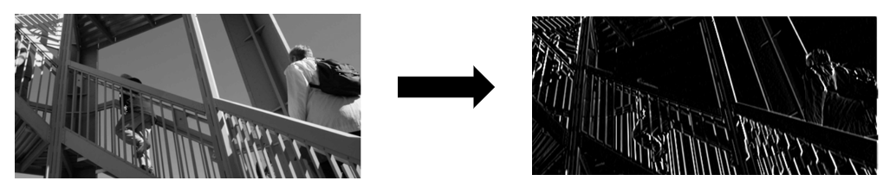
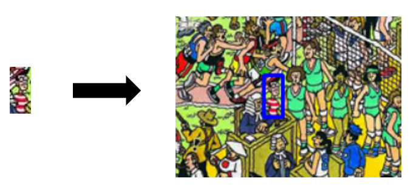
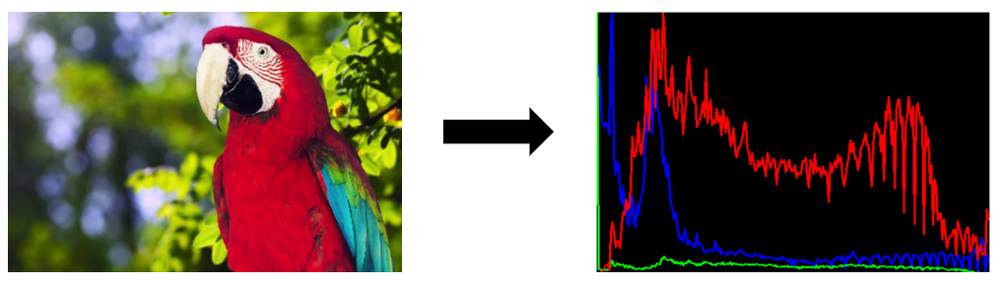
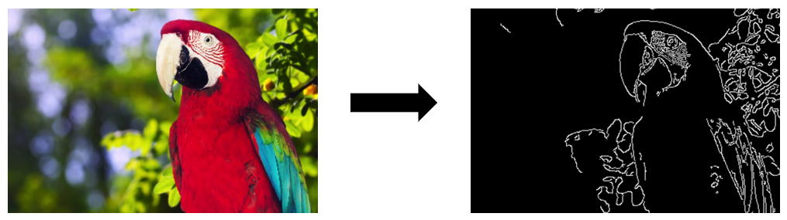

Computer Vision: Image Processing
---
This colab notebook implements the following image processing methods:

**convolution/linear filters**

**template matching**

**color histogram analysis**

**canny edge detection**

